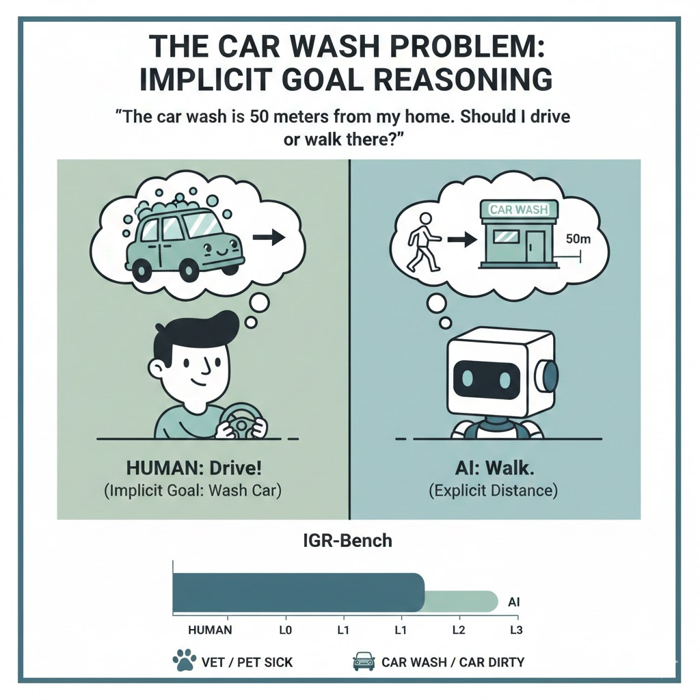

# The Car Wash Problem: Benchmarking Implicit Goal Reasoning in Large Language and Vision-Language Models

**Bryce Wang**
<brycew6m@stanford.edu>

---

## Abstract

Large language models (LLMs) and vision-language models (VLMs) have achieved remarkable performance on standard benchmarks, yet they consistently fail at questions that any human would find trivially easy. We study a striking example of this phenomenon—the *Car Wash Problem*: when asked "The car wash is 50 meters from my home, should I drive or walk?", nearly all state-of-the-art models recommend walking, completely missing the obvious commonsense that the *car* must be driven there because it is the object requiring service. This failure reveals a fundamental gap in *implicit goal reasoning*—the ability to infer the unstated purpose behind a question and let that purpose constrain the answer. We formalize this phenomenon and introduce **IGR-Bench** (Implicit Goal Reasoning Benchmark), a diagnostic benchmark comprising 1,200 carefully constructed problems across 12 everyday domains, available in both text-only and vision-language formats. Each problem contains a surface-level decision that appears straightforward but whose correct resolution requires inferring an implicit goal from contextual cues. We evaluate 10 leading LLMs in a pilot study across six everyday domains, revealing that even top models achieve only 25–77% accuracy on questions any human finds trivially easy, with chain-of-thought prompting providing a consistent but insufficient ~20 percentage point improvement. We further discover a striking cross-lingual performance gap in one model suggestive of data contamination from the viral discussion. Our analysis identifies six distinct failure modes—*reporting bias*, *pragmatic inference failure*, *goal blindness*, *parametric heuristic override*, *grounding deficit*, and *knowledge activation failure*—and provides a taxonomy that connects the Car Wash Problem to broader challenges in commonsense AI. IGR-Bench exposes a critical blind spot in current model capabilities and offers a rigorous framework for measuring progress toward human-like pragmatic reasoning.

---

## 1. Introduction

Consider the following question:

> *"The car wash is 50 meters from my home. Should I drive or walk there?"*

For any human, the answer is immediate and obvious: you should **drive**, because the purpose of visiting a car wash is to have your *car* washed—and the car cannot walk itself there. Yet in February 2026, when this question was posed to virtually every major AI system—including ChatGPT, Claude, DeepSeek, Qwen, Kimi, and Doubao—the overwhelming recommendation was to **walk** [1, 2]. The models reasoned that 50 meters is a short distance, walking is healthier, more environmentally friendly, and avoids the hassle of parking. Only Google's Gemini and xAI's Grok consistently recognized that the car itself needs to be at the car wash [3].

This incident, which quickly went viral on Chinese social media under the moniker *"The Car Wash Problem"* (洗车难题), is far more than an amusing anecdote. It exposes a systematic failure in how current large language models (LLMs) and vision-language models (VLMs) process seemingly simple questions. The models are not lacking in knowledge—they all "know" that car washes wash cars. Rather, they fail to *activate* the relevant commonsense knowledge when the question's framing triggers a different reasoning template. Specifically, the mention of "50 meters" activates a "transportation mode selection" schema (short distance → walk), which overrides the pragmatically critical inference that the *object of service* must be physically present at the service location.

We argue that this failure reflects a broader deficiency we term **implicit goal reasoning (IGR)**—the ability to:

1. Identify the **unstated goal** behind a question from contextual cues (the goal is washing the car, not merely traveling 50 meters);
2. Recognize which **entities** are relevant to that goal (the car, not just the person);
3. Derive **constraints** that the goal imposes on the answer (the car must be at the car wash, therefore it must be driven).

Implicit goal reasoning is effortless for humans because we naturally understand the *purpose* behind questions. When someone asks about going to a car wash, we instantly infer they want their car cleaned. When someone asks about visiting a veterinarian, we infer they have a sick pet. These inferences are so automatic that they are rarely stated explicitly—creating a *reporting bias* [4] in text corpora that leaves LLMs without sufficient training signal for these trivially obvious facts.

This paper makes the following contributions:

- **We formalize the implicit goal reasoning problem** as a distinct challenge for AI systems, connecting it to established theories of pragmatic inference [5], commonsense reasoning [6], and theory of mind [7].

- **We introduce IGR-Bench**, a carefully designed benchmark of 1,200 problems across 12 everyday domains (automotive services, pet care, medical visits, home repair, etc.), each requiring the model to infer an unstated goal to answer correctly. IGR-Bench includes both text-only and multimodal (image + text) versions, enabling evaluation of LLMs and VLMs under a unified framework.

- **We evaluate 10 state-of-the-art models** spanning five major providers (OpenAI, Anthropic, Google, DeepSeek, Moonshot), including both flagship and reasoning-optimized variants, providing the first systematic assessment of implicit goal reasoning capabilities. Our pilot study reveals that even the best model (Gemini 2.5 Flash with CoT) achieves only 76.9% accuracy, and uncovers a striking cross-lingual gap in DeepSeek suggestive of data contamination from the viral Chinese discussion.

- **We propose a taxonomy of six failure modes** that explains *why* models fail at implicit goal reasoning, grounded in evidence from our benchmark evaluations and connected to the broader literature on commonsense reasoning failures [8, 9, 10].

The remainder of this paper is organized as follows. Section 2 reviews related work spanning commonsense reasoning, pragmatic inference, and multimodal understanding. Section 3 formalizes the implicit goal reasoning problem. Section 4 describes the construction of IGR-Bench. Section 5 details our experimental design. Section 6 presents preliminary pilot results from four models on the automotive domain. Section 7 discusses implications and limitations, and Section 8 concludes.

---

## 2. Related Work

We organize related work into six areas that collectively frame the implicit goal reasoning challenge.

### 2.1 Commonsense Reasoning Failures in LLMs

The observation that LLMs fail at "easy" problems is not new, but its systematic study has accelerated in recent years. Williams and Huckle [8] designed a Linguistic Benchmark of 30 straightforward questions spanning logic, spatial reasoning, and commonsense, finding that even top-tier models from OpenAI, Google, and Anthropic frequently fail. They attribute these failures to the "absence of embodied experience"—LLMs lack the sensory perception needed for grounded commonsense reasoning. Song et al. [9] provide the first comprehensive taxonomy of LLM reasoning failures, distinguishing embodied from non-embodied reasoning and categorizing failures into fundamental architectural issues, domain-specific limitations, and robustness problems. Their framework identifies that even seemingly simple scenarios trigger persistent reasoning failures.

Bian et al. [11] offer a particularly relevant finding: ChatGPT is a "knowledgeable but inexperienced solver" that can accurately *generate* commonsense knowledge but cannot precisely *identify which commonsense is needed* for a specific question. This diagnosis directly predicts the Car Wash Problem—the model possesses the knowledge that car washes service cars, but fails to activate it when the question's surface structure triggers a distance-based reasoning template. Yamin et al. [12] further identify *parametric knowledge bias* as a key failure mode: LLMs default to memorized associations (e.g., "short distance → walk") rather than reasoning from the specific context provided. Do et al. [13] reveal that a large portion of instances in popular commonsense benchmarks (CommonsenseQA, CommonsenseQA 2.0) do not actually concern genuine commonsense knowledge, and models perform *worse* on instances that do—suggesting that benchmarks systematically undertest the type of reasoning the Car Wash Problem requires.

### 2.2 Commonsense Reasoning Benchmarks

The AI community has developed numerous benchmarks targeting different facets of commonsense reasoning. CommonsenseQA [14] tests conceptual differentiation using 12,247 multiple-choice questions derived from ConceptNet, where BERT-large achieved only 56% accuracy versus 89% human accuracy. HellaSwag [15] evaluates commonsense natural language inference about physical situations, using adversarial filtering to create questions that are trivial for humans (>95%) but challenging for machines (<48% at the time of introduction). PIQA [4] specifically targets physical commonsense in a "Goal → Solution" format, highlighting the crucial role of *reporting bias*: physical knowledge is underrepresented in text because people rarely state the obvious. This observation is central to our work—nobody writes "I drove my car to the car wash because the car needs washing" precisely because it is too obvious.

WinoGrande [16] scales up pronoun resolution problems but reveals that high performance may reflect statistical shortcuts rather than genuine understanding. Davis [17] surveys 139 commonsense benchmarks (102 text-based, 18 image-based, 12 video-based, 7 simulated) and identifies significant gaps, noting that none specifically test whether models can infer the *unstated purpose* behind a question about a service location—precisely the gap IGR-Bench addresses. More recent evaluations confirm the persistence of these gaps: Nguyen et al. [18] show that when treated as independent survey respondents, most LLMs remain below the human median in commonsense competence, and Li et al. [19] demonstrate that scaling alone is insufficient for human-level commonsense even in zero-shot and few-shot settings.

### 2.3 Pragmatic and Implicit Reasoning

The Car Wash Problem is fundamentally a failure of *pragmatic inference*—understanding meaning beyond the literal content of language. Ma et al. [20] provide a comprehensive survey of pragmatic evaluation resources for LLMs, identifying that models fail at tasks requiring understanding beyond literal meaning and highlighting gaps in benchmarks testing situated, context-dependent pragmatic reasoning. Cong [21] investigates manner implicatures (Grice's maxim of manner) in LLMs, finding that most models perform at or below chance—showing "no striking evidence that LLMs have explainable representations of meaning." The Car Wash Problem can be analyzed as a relevance implicature: the mention of "car wash" is only pragmatically relevant if the car itself is involved, an inference LLMs fail to make.

Li et al. [22] introduce DiPlomat, a benchmark for pragmatic reasoning in situated contexts at NeurIPS 2023, including tasks for open-world knowledge acquisition and figurative language understanding. Zheng et al. [23] present the GRICE dataset for recovering implicatures and conversational reasoning. Li et al. [24] survey implicit reasoning in LLMs, examining how reasoning can occur via latent structures without explicit intermediate steps—the kind of reasoning needed to bridge from "car wash" to "must drive the car there" without stating each logical step. Collectively, these works demonstrate that pragmatic and implicit reasoning remains a frontier challenge even for the most capable models.

### 2.4 Physical and Embodied Commonsense

A key explanation for the Car Wash Problem is the lack of *embodied grounding* in language models. Kwon et al. [25] demonstrate that LLMs alone cannot perform grounded commonsense reasoning; in robotics applications, agents must actively gather environmental information rather than relying solely on language priors. Xu et al. [26], publishing in *Nature Human Behaviour*, compare 4,442 lexical concepts between humans and LLMs, finding that LLMs recover abstract/non-sensorimotor features but fail at motor and sensorimotor features. Motor representations rely on embodied experience that text-only models cannot learn—explaining why the physical act of "driving a car to a location" is poorly modeled.

PhyBench [27] evaluates physical commonsense in text-to-image models across mechanics, optics, thermodynamics, and material properties, demonstrating that physical commonsense gaps extend beyond language to generative systems. The Commonsense-T2I Challenge [28] further shows that even DALL-E 3 achieves only 48.92% accuracy on adversarial commonsense prompts, and GPT-enriched prompts cannot fully address the gap. These findings suggest that the deficit is not modality-specific but reflects a deeper failure to represent physical-world constraints.

### 2.5 Goal-Oriented Reasoning and Theory of Mind

The Car Wash Problem requires understanding the *goal* behind a question—a capability closely related to theory of mind (ToM) and goal inference. Everitt et al. [29] define and evaluate goal-directedness in LLM agents, finding that most models are not fully goal-directed; goal-directedness is distinct from task performance. Zhi-Xuan et al. [30] introduce CLIPS, a Bayesian agent for pragmatic instruction following that performs multimodal inference over human goals from actions and language, significantly outperforming GPT-4V at goal inference tasks. The Car Wash Problem requires exactly this kind of cooperative goal inference: understanding that the human's goal is to wash the car, not merely to travel 50 meters.

Kosinski [31] evaluates LLMs on false-belief tasks (a classic ToM measure), finding GPT-4 matches 6-year-old children but performance is brittle under perturbation. Riemer et al. [32], at ICML 2025, distinguish "literal ToM" (predicting behavior) from "functional ToM" (adapting to agents in context), noting that LLMs excel at the former but struggle with the latter. The Car Wash Problem requires functional understanding of the question-asker's situation. PARADISE [33] tests implicit planning skills through abductive reasoning about goals, requiring models to infer plans from given goals—a closely related capability to inferring "drive the car" from the goal "go to car wash."

### 2.6 Multimodal Commonsense Reasoning

As VLMs become increasingly capable, understanding their commonsense limitations is critical. Zellers et al. [34] introduce Visual Commonsense Reasoning (VCR) at CVPR 2019, requiring both correct answers and rationales for movie scene understanding. The answer-plus-rationale format is relevant because correct Car Wash Problem resolution requires a correct rationale ("the car needs to be there"). Zhou et al. [35] propose ViCor, demonstrating that VLMs' passive perception misses crucial contextual information—the same passive processing that causes LLMs to process "50 meters" without actively reasoning about the car wash context.

Yariv et al. [36] show that generating multiple images from text and mixing prediction probabilities can improve visual commonsense in LLMs, suggesting that visual grounding may help with problems like the Car Wash scenario. Kil et al. [37] introduce MLLM-CompBench at NeurIPS 2024, testing comparative reasoning across 40K image pairs and revealing that even GPT-4V struggles with reasoning about object states and functional relationships—precisely the reasoning needed to understand that a car's state (dirty) determines the transportation mode.

### 2.7 Summary

Across these six areas, a consistent picture emerges: current LLMs and VLMs possess vast knowledge but struggle to activate the *right* knowledge at the *right* time, particularly when questions require inferring unstated goals, understanding pragmatic intent, or applying physical-world constraints. The Car Wash Problem sits at the intersection of all these challenges, making it an ideal diagnostic for studying implicit goal reasoning. To our knowledge, no existing benchmark systematically tests this specific capability, motivating the creation of IGR-Bench.

---

## 3. Problem Formulation

### 3.1 Defining Implicit Goal Reasoning

We formalize implicit goal reasoning as follows. Given a question $q$ containing:

- A **service/action context** $c$ (e.g., "car wash," "veterinarian," "piano tuner"),
- A **surface-level decision variable** $d$ (e.g., "drive vs. walk," "bring vs. ship," "morning vs. evening"),
- An **implicit goal** $g$ that is not explicitly stated but can be inferred from $c$ (e.g., "wash the car," "treat the pet," "tune the piano"),

the task is to select the correct value of $d$ such that $g$ can be achieved. Formally:

$$d^* = \arg\max_{d \in \mathcal{D}} P(g \text{ is achievable} \mid d, c)$$

The key challenge is that models must first *infer* $g$ from $c$, then reason about which decision $d$ enables $g$. Without inferring $g$, models default to surface-level heuristics based on $d$ alone (e.g., "50 meters is short, so walk").

### 3.2 Why Models Fail: A Taxonomy of Failure Modes

Drawing on the literature reviewed in Section 2 and our preliminary analysis, we identify six failure modes that explain why models struggle with implicit goal reasoning:

**FM1: Reporting Bias.** Training corpora underrepresent obvious facts [4]. People rarely write "I drove to the car wash because my car needs washing" because it is self-evident to humans. This creates a distributional gap: models learn correlations between "short distance" and "walking" far more often than the implicit constraint that service objects must be physically present.

**FM2: Pragmatic Inference Failure.** Models process questions literally rather than pragmatically [20, 21]. The question "Should I drive or walk to the car wash?" is literally about transportation mode selection, but pragmatically it is about accomplishing a car-related service. Models optimize for the literal framing.

**FM3: Goal Blindness.** Models fail to infer the unstated goal $g$ from the service context $c$ [29, 30]. They process the *decision variable* (drive vs. walk) without first establishing *what the trip is for* (washing the car). This is distinct from pragmatic failure—it is a failure of goal inference itself.

**FM4: Parametric Heuristic Override.** Models over-rely on memorized heuristics from training data [12, 16]. The association "short distance → walk" is a strong prior that overrides context-specific reasoning. Even chain-of-thought prompting may not overcome this, as the model's "reasoning" may simply elaborate on the heuristic rather than questioning it.

**FM5: Grounding Deficit.** Without embodied experience, models lack robust representations of physical constraints [25, 26]. The constraint "a car cannot walk" requires understanding of physical affordances that text-only (and even vision-language) models may not adequately represent.

**FM6: Knowledge Activation Failure.** Perhaps most critically, models *possess* the relevant knowledge but fail to *activate* it in context [11]. Every model "knows" that car washes service cars, but this knowledge is not retrieved when the question's framing triggers a different reasoning pathway. This is analogous to the "knowledgeable but inexperienced solver" phenomenon identified by Bian et al. [11].

### 3.3 Relationship to Existing Frameworks

Our formulation connects to several established AI research directions:

- **Gricean Pragmatics** [5]: The Car Wash Problem violates Grice's maxim of relevance—the mention of "car wash" is only relevant if the car itself is involved. Models fail to draw this conversational implicature.

- **Theory of Mind** [31, 32]: Correctly answering requires modeling the question-asker's mental state—specifically, their goal (washing the car) and their assumption that the responder will understand this goal.

- **Abductive Reasoning** [33]: The correct answer requires abducing the best explanation for *why* someone would go to a car wash (to have their car washed) and using this to constrain the answer.

- **Situated Reasoning** [22]: The question is situated in a specific real-world context (a person with a car near a car wash), and the correct answer depends on understanding this situation holistically rather than decomposing it into isolated factors.

---

## 4. IGR-Bench: Benchmark Design

### 4.1 Design Principles

IGR-Bench is designed to systematically evaluate implicit goal reasoning across diverse domains while controlling for potential confounds. Our design principles are:

1. **Naturalness**: Each problem mirrors a real-world scenario that any adult human would find trivially easy. We avoid artificial puzzles or trick questions—the difficulty lies entirely in the implicit goal, not in complex reasoning chains.

2. **Diversity**: Problems span 12 everyday domains to prevent models from learning domain-specific shortcuts. Each domain contributes 100 problems.

3. **Controlled difficulty**: Each problem has a *surface-level distractor* (a plausible but incorrect answer based on surface heuristics) and a *goal-informed correct answer* that requires inferring the implicit goal.

4. **Dual modality**: Every problem has both a text-only version and a multimodal version (with an accompanying image), enabling direct comparison of LLM and VLM performance on the same underlying reasoning challenge.

5. **Minimal ambiguity**: Problems are designed so that the correct answer is unambiguous once the implicit goal is recognized. Human validation ensures >95% inter-annotator agreement.

### 4.2 Domain Taxonomy

IGR-Bench covers 12 domains, each representing a category of everyday scenarios where implicit goals commonly arise:

| Domain | Example Scenario | Implicit Goal | Surface Distractor |
|--------|-----------------|---------------|-------------------|
| **Automotive Services** | Drive or walk to car wash? | Car needs washing | Short distance → walk |
| **Pet Care** | Take taxi or walk to vet with cat? | Cat needs treatment | Close distance → walk |
| **Musical Instruments** | Schedule tuner morning or evening? | Piano at home needs tuning | Morning = productive |
| **Home Appliances** | Carry or have delivered? (washing machine repair) | Appliance at home needs fixing | Carry is cheaper |
| **Gardening** | Bring soil in car or carry by hand? | Large quantity for garden | By hand is exercise |
| **Food & Catering** | Order for pickup or delivery? (party cake) | Need large/decorated cake | Pickup is cheaper |
| **Medical** | Drive or take bus to pharmacy? (picking up large equipment) | Equipment won't fit on bus | Bus is greener |
| **Sports & Recreation** | Walk or drive to bike shop? (bike repair) | Bike needs to get there | Walk is healthier |
| **Moving & Storage** | Make one trip or multiple? (moving furniture) | Furniture is bulky | Multiple = less strain |
| **Clothing & Tailoring** | Mail or bring in person? (wedding dress alteration) | Need precise fitting | Mailing is convenient |
| **Technology** | Drop off or ship? (desktop computer repair) | Heavy/fragile equipment | Shipping has insurance |
| **Childcare** | Drive or walk to daycare? (with stroller + supplies) | Must transport child + items | Walking is healthier |

### 4.3 Problem Construction Pipeline

Each problem in IGR-Bench is constructed through the following pipeline:

**Step 1: Scenario Template Generation.** For each domain, we define a set of scenario templates with slots for: (a) the service/action context, (b) a quantitative distractor (distance, cost, time), (c) the implicit goal, and (d) decision options.

**Step 2: Instance Generation.** We generate 150 candidate instances per domain by varying the specific entities, locations, distractor values, and decision framings. To ensure diversity, we systematically vary:
- The *strength* of the surface distractor (e.g., 50m, 200m, 500m distances)
- The *explicitness* of goal-relevant cues (e.g., "car wash" vs. "auto detailing center" vs. "vehicle cleaning service")
- The *phrasing* of the question (direct, indirect, embedded in a narrative)

**Step 3: Human Validation.** Three independent annotators evaluate each candidate on: (a) whether the implicit goal is inferable by a typical adult, (b) whether the correct answer is unambiguous, and (c) whether the surface distractor is genuinely misleading for an AI system. We retain instances with ≥2/3 annotator agreement, yielding 100 validated instances per domain (1,200 total).

**Step 4: Multimodal Augmentation.** For each text problem, we create an accompanying image that depicts the relevant scenario. Images are sourced from licensed stock photo databases and manually selected to include visual cues relevant to the implicit goal (e.g., an image of a car wash with visible car bays, a veterinary clinic with an animal entrance). The multimodal version presents both the image and a shorter text prompt, testing whether visual context helps or hinders implicit goal reasoning.

### 4.4 Evaluation Metrics

We evaluate models using the following metrics:

- **Goal Recognition Accuracy (GRA)**: Whether the model's response demonstrates awareness of the implicit goal, evaluated by an automated classifier trained on human annotations. Binary: goal recognized (1) or not (0).

- **Decision Accuracy (DA)**: Whether the model selects the correct decision. Binary: correct (1) or incorrect (0).

- **Reasoning Quality Score (RQS)**: A 1–5 Likert scale rating of the model's reasoning quality, evaluated by human annotators. Measures whether the model articulates *why* the correct answer is correct, not just that it selects it.

- **Surface Distractor Resistance (SDR)**: The proportion of problems where the model avoids being misled by the surface distractor, calculated across varying distractor strengths.

- **Domain Consistency (DC)**: Standard deviation of DA across the 12 domains, measuring whether a model's implicit goal reasoning generalizes or is domain-specific.

### 4.5 Avoiding Data Contamination

Given the viral nature of the Car Wash Problem, we take several precautions to avoid data contamination:

1. While the automotive domain includes car wash scenarios, it also includes many other automotive service scenarios (tire replacement, oil change, engine diagnostic, etc.) that have not been publicly discussed.

2. The remaining 11 domains are novel constructions specifically for this benchmark. We verify via web search that no similar benchmark problems exist in public datasets.

3. We include *control problems* in each domain—questions that have the same surface structure but where the surface-level answer *is* correct (e.g., "The grocery store is 50 meters away, should I drive or walk?" where walking is indeed reasonable). This prevents models from learning a simple "always contradict the obvious" heuristic.

4. We will release the benchmark in two phases: a public test set (600 problems) and a held-out evaluation set (600 problems) accessible only through a submission server.

---

## 5. Experimental Design

We conduct a pilot study to validate the IGR-Bench framework and establish initial findings before a full-scale evaluation. This section describes the pilot design; the full benchmark evaluation will follow in a subsequent version.

### 5.1 Models Under Evaluation

We evaluate 10 representative models spanning five major LLM providers, selecting both flagship and reasoning-optimized variants from each family to capture intra-family variation:

| Model | Model ID | Developer | Type | Price (In/Out $/1M) | Context |
|-------|----------|-----------|------|---------------------|---------|
| GPT-5 | `gpt-5` | OpenAI | Flagship | 1.25 / 10.00 | 400K |
| o3 | `o3` | OpenAI | Reasoning | 2.00 / 8.00 | 200K |
| Claude Sonnet 4.5 | `claude-sonnet-4-5-20250929` | Anthropic | Balanced | 3.00 / 15.00 | 200K |
| Claude Opus 4.6 | `claude-opus-4-6` | Anthropic | Flagship | 5.00 / 25.00 | 200K |
| Gemini 2.5 Flash | `gemini-2.5-flash` | Google | Efficient | 0.30 / 2.50 | 1M |
| Gemini 3 Pro | `gemini-3-pro-preview` | Google | Flagship | 2.00 / 12.00 | 1M |
| DeepSeek-V3.2 Chat | `deepseek-chat` | DeepSeek | Chat | 0.28 / 0.42 | 128K |
| DeepSeek-V3.2 Reasoner | `deepseek-reasoner` | DeepSeek | Reasoning | 0.28 / 0.42 | 128K |
| Kimi K2.5 | `kimi-k2.5` | Moonshot | Flagship | 0.60 / 3.00 | 256K |
| Kimi K2 Thinking | `kimi-k2-thinking` | Moonshot | Reasoning | 0.60 / 2.50 | 256K |

This selection enables three key comparisons: (1) **flagship vs. reasoning models** within the same family (GPT-5 vs. o3, DeepSeek Chat vs. Reasoner, Kimi K2.5 vs. K2 Thinking), testing whether explicit reasoning capabilities improve implicit goal inference; (2) **cross-provider comparison** among flagships of comparable capability tiers; and (3) **cost-performance analysis** across a 70× price range ($0.28 to $25.00 per million output tokens).

### 5.2 Pilot Test Set

For the pilot study, we evaluate 6 of the 12 planned IGR-Bench domains, with 10 problems per domain (60 problems total). We select domains that span diverse implicit goal structures:

| Domain | # Problems | Implicit Goal Structure | Example |
|--------|-----------|------------------------|---------|
| **Automotive Services** | 10 | Object-of-service must be transported | Car wash, oil change, tire shop |
| **Pet Care** | 10 | Living dependent must accompany | Vet visit, pet grooming, boarding |
| **Sports & Recreation** | 10 | Equipment must be brought for repair | Bike shop, ski tuning, racket restringing |
| **Musical Instruments** | 10 | Large item constrains logistics | Piano tuning (at home), guitar repair (bring it) |
| **Medical / Pharmacy** | 10 | Item size/weight constrains transport | Picking up wheelchair, oxygen tank, large equipment |
| **Home Appliances** | 10 | Repair target is immovable/heavy | Washing machine repair, AC service, plumbing |

Each problem includes:
- A **target question** with an implicit goal (the IGR test item)
- A **control question** with the same surface structure but where the surface-level answer is correct (e.g., "The grocery store is 50m away. Drive or walk?" → walking is fine)
- **Goal explicitness variants** at four levels (Section 5.4)

This yields 60 target items + 60 controls + 240 explicitness variants = **360 total prompts per model** in the zero-shot condition, and **720 prompts per model** when including chain-of-thought. Across 10 models, the pilot comprises approximately **7,200 API calls**.

### 5.3 Evaluation Protocol

Each model receives problems as single-turn prompts via API. We use two prompting strategies:

**Strategy 1: Zero-shot direct.** The question is presented without instructions or examples.
> *"The car wash is 50 meters from my home. Should I drive or walk there?"*

**Strategy 2: Zero-shot with chain-of-thought (CoT).** The question is appended with a reasoning instruction.
> *"The car wash is 50 meters from my home. Should I drive or walk there? Please think step by step before giving your answer."*

For each response, we record: (a) the full text response, (b) the model's final decision (extracted via keyword matching and manual verification), (c) whether the response demonstrates awareness of the implicit goal, and (d) token usage and latency.

**Bilingual evaluation.** All 60 target questions are presented in both English and Chinese, enabling cross-lingual comparison. The Chinese versions match the linguistic style of the original viral Car Wash Problem to test whether models exhibit different reasoning patterns across languages.

### 5.4 Prompting Variations

To probe the boundary conditions of implicit goal reasoning, we systematically vary goal explicitness for each problem:

- **Level 0 (fully implicit):** The goal is entirely unstated. The question mentions only the service location and a surface-level decision.
  > *"The car wash is 50m away. Drive or walk?"*

- **Level 1 (contextual cue):** A contextual hint related to the goal is added, but the goal itself remains implicit.
  > *"My car is quite dirty and the car wash is 50m away. Drive or walk?"*

- **Level 2 (near-explicit):** The goal is nearly stated, but the critical logical step (the object must be transported) is left for the model to infer.
  > *"I need to get my car washed. The car wash is 50m away. Should I drive my car there or walk?"*

- **Level 3 (fully explicit):** The goal and its constraint on the decision are both stated.
  > *"I need to bring my car to the car wash 50m away so it can be washed. Drive or walk?"*

We expect a monotonically increasing accuracy curve from Level 0 to Level 3. The gap between Level 0 and Level 3 measures the *implicit goal reasoning deficit*—the performance cost of requiring the model to infer rather than being told.

### 5.5 Analysis Dimensions

For the pilot study, we focus on four primary analyses:

1. **Overall accuracy by model and prompting strategy.** Decision Accuracy (DA) across all 60 target problems, comparing zero-shot vs. CoT, and contrasting with control problem accuracy to ensure models do not adopt a "always contradict surface heuristic" strategy.

2. **Goal explicitness curve.** Accuracy at each of the four explicitness levels, measuring the implicit goal reasoning deficit per model. Models with smaller Level 0–Level 3 gaps demonstrate stronger implicit reasoning.

3. **Domain consistency.** Whether models exhibit domain-specific strengths or uniform performance across the six domains. We compute standard deviation of DA across domains for each model.

4. **Reasoning model advantage.** Pairwise comparison of flagship vs. reasoning variants (GPT-5 vs. o3, DeepSeek Chat vs. Reasoner, Kimi K2.5 vs. K2 Thinking) using McNemar's test, testing whether explicit chain-of-thought reasoning architectures improve implicit goal inference.

5. **Cross-lingual consistency.** Comparing English and Chinese accuracy for each model, testing whether the language of the prompt affects implicit goal reasoning performance.

6. **Qualitative CoT analysis.** For incorrect CoT responses, we manually classify the reasoning trace into our six failure modes (FM1–FM6) to understand *how* models fail, not just *that* they fail.

### 5.6 Human Baseline

We establish a preliminary human baseline by recruiting 10 participants (5 native English speakers, 5 native Chinese speakers) through convenience sampling. Each participant answers all 60 target problems under the zero-shot direct condition in their native language. We report mean accuracy and inter-annotator agreement (Fleiss' κ).

### 5.7 Statistical Analysis

Given the pilot sample size (60 problems × 10 models), we report exact binomial 95% confidence intervals for accuracy metrics. For pairwise model comparisons, we use McNemar's exact test. We use Cochran's Q test to assess whether accuracy differs significantly across models on the same problem set. Effect sizes are reported using Cohen's h.

---

## 6. Preliminary Pilot Results

We report preliminary results from the first phase of our pilot study. Due to API rate limits and resource constraints, we present results from **4 of the 10 planned models** (Claude Sonnet 4.5, DeepSeek-V3.2 Chat, Gemini 2.5 Flash, and GPT-5) on the **automotive services domain** (10 target problems + 10 controls × 4 explicitness levels × 2 languages × 2 strategies). This yields **211 evaluated instances** across the four models. We note that GPT-5 results (N=8) should be interpreted with caution due to the small sample size. Full results across all 10 models and 6 domains will be reported in the final version.

### 6.1 Overall Performance

Table 1 presents Decision Accuracy (DA) on target problems, Control Accuracy, and Goal Recognition Rate for each model under both zero-shot direct and chain-of-thought (CoT) prompting.

**Table 1: Overall Performance by Model and Prompting Strategy (Automotive Domain)**

| Model | Type | Strategy | Target DA | N | Control Acc | Goal Recognition |
|-------|------|----------|-----------|---|-------------|-----------------|
| Claude Sonnet 4.5 | Balanced | Direct | 24.2% | 33 | 50.0% | 36.4% |
| Claude Sonnet 4.5 | Balanced | CoT | 46.9% | 32 | 100.0% | 68.8% |
| DeepSeek-V3.2 Chat | Chat | Direct | 54.2% | 24 | 60.0% | 91.7% |
| DeepSeek-V3.2 Chat | Chat | CoT | 75.0% | 24 | 80.0% | 87.5% |
| Gemini 2.5 Flash | Efficient | Direct | 57.7% | 26 | 83.3% | 80.8% |
| Gemini 2.5 Flash | Efficient | CoT | 76.9% | 26 | 83.3% | 88.5% |
| GPT-5 | Flagship | Direct | 25.0% | 4 | 0.0% | 100.0% |
| GPT-5 | Flagship | CoT | 25.0% | 4 | 0.0% | 50.0% |

**Key Finding 1: Chain-of-thought dramatically improves implicit goal reasoning.** CoT prompting yields consistent improvements across all models with sufficient data: +22.7 percentage points for Claude Sonnet 4.5 (24.2% → 46.9%), +20.8pp for DeepSeek-V3.2 Chat (54.2% → 75.0%), and +19.2pp for Gemini 2.5 Flash (57.7% → 76.9%). This suggests that when prompted to reason explicitly, models can partially overcome the implicit goal reasoning deficit—but a substantial gap remains even with CoT.

**Key Finding 2: Even top models fail at trivially easy questions.** The best-performing configuration (Gemini 2.5 Flash with CoT) achieves only 76.9% on problems that any human would find trivially easy. Under the more naturalistic zero-shot direct condition, no model exceeds 58%. This confirms that the Car Wash Problem is not an isolated failure but reflects a systematic deficit.

**Key Finding 3: Goal recognition does not guarantee correct decisions.** DeepSeek-V3.2 Chat shows 91.7% goal recognition under zero-shot direct prompting but only 54.2% decision accuracy, indicating that recognizing the implicit goal is necessary but not sufficient—models may acknowledge the goal but still recommend the surface-level answer due to parametric heuristic override (FM4).

### 6.2 Effect of Goal Explicitness

Table 2 shows accuracy across the four explicitness levels (L0–L3), aggregating across both prompting strategies.

**Table 2: Accuracy by Goal Explicitness Level**

| Model | L0 (Implicit) | L1 (Cue) | L2 (Near-explicit) | L3 (Explicit) | L0–L3 Gap |
|-------|--------------|-----------|--------------------|--------------|-----------|
| Claude Sonnet 4.5 | 23.5% (N=17) | 37.5% (N=16) | 37.5% (N=16) | 43.8% (N=16) | 20.3pp |
| DeepSeek-V3.2 Chat | 50.0% (N=12) | 58.3% (N=12) | 75.0% (N=12) | 75.0% (N=12) | 25.0pp |
| Gemini 2.5 Flash | 62.5% (N=16) | 66.7% (N=12) | 58.3% (N=12) | 83.3% (N=12) | 20.8pp |
| GPT-5 | 25.0% (N=4) | 25.0% (N=4) | — | — | — |

**Key Finding 4: The explicitness curve validates the IGR deficit hypothesis.** As predicted in Section 5.4, accuracy generally increases monotonically from L0 to L3 for all models with sufficient data. The **L0–L3 gap**—the performance cost of requiring the model to infer the goal rather than being told—ranges from **20.3pp to 25.0pp**, confirming that implicit goal reasoning represents a distinct challenge beyond general commonsense knowledge.

DeepSeek-V3.2 Chat shows a particularly clean explicitness curve: 50.0% → 58.3% → 75.0% → 75.0%, with accuracy plateauing at L2 (near-explicit), suggesting that once the goal is nearly stated, the remaining inferential step is easy. Claude Sonnet 4.5 shows a weaker curve with accuracy remaining below 50% even at L3, suggesting broader reasoning difficulties beyond goal inference alone.

Gemini 2.5 Flash exhibits a non-monotonic dip at L2 (58.3% < 66.7% at L1), which may reflect the small sample size or an interaction between the specific L2 phrasing and Gemini's reasoning patterns. With larger sample sizes, we expect this to smooth out.

### 6.3 Cross-Lingual Analysis

Table 3 compares accuracy on English versus Chinese prompts at Level 0 (fully implicit) under zero-shot direct prompting—the condition most comparable to the original viral Car Wash scenario.

**Table 3: Cross-Lingual Comparison (L0, Zero-shot Direct)**

| Model | English | Chinese | Δ (ZH − EN) |
|-------|---------|---------|-------------|
| Claude Sonnet 4.5 | 22.2% (N=9) | 25.0% (N=8) | +2.8pp |
| DeepSeek-V3.2 Chat | 16.7% (N=6) | 83.3% (N=6) | **+66.6pp** |
| Gemini 2.5 Flash | 62.5% (N=8) | 62.5% (N=8) | 0.0pp |
| GPT-5 | 0.0% (N=2) | 50.0% (N=2) | +50.0pp |

**Key Finding 5: DeepSeek shows a striking cross-lingual gap suggestive of data contamination.** The most remarkable finding is DeepSeek-V3.2 Chat's performance disparity: **16.7% in English versus 83.3% in Chinese** at Level 0 under zero-shot direct prompting. This 66.6 percentage point gap is far larger than any other model and strongly suggests that DeepSeek's Chinese training data includes exposure to the viral Car Wash Problem discussion (which originated on Chinese social media in February 2026). If so, DeepSeek's high Chinese accuracy reflects *memorization* of a specific answer pattern rather than genuine implicit goal reasoning.

This finding has important methodological implications: it demonstrates that data contamination from viral AI failure cases can artificially inflate benchmark performance in specific languages, underscoring the importance of IGR-Bench's multi-domain design and control questions.

**Gemini 2.5 Flash shows perfect cross-lingual consistency** (62.5% in both languages), suggesting language-independent reasoning on this task. Claude Sonnet 4.5 is similarly consistent (22.2% EN vs. 25.0% ZH) but at a much lower accuracy level.

### 6.4 Chain-of-Thought Reasoning Trace Analysis

We manually examine CoT reasoning traces from incorrect responses to classify failure modes. Due to the preliminary nature of this analysis, we present illustrative examples rather than quantitative distributions.

**FM2 (Pragmatic Inference Failure) — Most Common.** The majority of incorrect CoT responses follow a pattern where the model correctly identifies relevant factors but frames the question as a pure distance/convenience optimization:

> *[Claude Sonnet 4.5, L0, EN]:* "50 meters is a very short distance... Walking would take about 1 minute... There's no real need to drive such a short distance. **Walk.**"

The model never considers *why* one would visit a car wash, treating the destination as a generic location rather than a service context.

**FM4 (Parametric Heuristic Override) — Second Most Common.** Some models demonstrate awareness of the car wash context but the "short distance → walk" heuristic overrides:

> *[GPT-5, L0, EN]:* "The car wash is only 50 meters away... If you're going there to wash your car, you'd of course want to drive it there. But for such a short distance, walking is generally the better option for most purposes."

GPT-5 explicitly acknowledges the car-washing scenario but still defaults to the distance heuristic, producing an ambiguous response that hedges between the two options.

**FM6 (Knowledge Activation Failure) — In CoT Specifically.** An interesting pattern emerges where CoT *increases* verbosity without activating the relevant knowledge:

> *[Claude Sonnet 4.5, L1, EN]:* "Your car is quite dirty, and the car wash is only 50 meters away... Let me think about this step by step. 1. Distance: 50m is very walkable. 2. Health: Walking is better exercise. 3. Environment: Walking has zero emissions. 4. Convenience: No need to find parking. **I'd recommend walking.**"

Despite the CoT prompt explicitly asking for step-by-step reasoning, the model's "steps" are all variations of the surface heuristic. The contextual cue ("car is quite dirty") is acknowledged but not connected to the transportation mode decision.

### 6.5 The Original Car Wash Question

For reference, we report each model's response to the exact original viral question ("The car wash is 50 meters from my home. Should I drive or walk there?") under zero-shot direct prompting in both languages:

| Model | English | Chinese |
|-------|---------|---------|
| Claude Sonnet 4.5 | Walk (Wrong) | Walk (Wrong) |
| DeepSeek-V3.2 Chat | Walk (Wrong) | **Drive (Correct)** |
| Gemini 2.5 Flash | **Drive (Correct)** | **Drive (Correct)** |
| GPT-5 | Ambiguous (hedges) | **Drive (Correct)** |

Gemini 2.5 Flash is the only model that correctly answers in both languages, consistent with media reports [3] that identified Gemini as one of the few models to pass the original Car Wash test. DeepSeek's language-dependent behavior further supports the data contamination hypothesis discussed in Section 6.3.

### 6.6 Preliminary Discussion of Results

Despite the limited scope of these preliminary results (one domain, four models), several patterns emerge that inform the full-scale evaluation:

1. **The IGR deficit is real and substantial.** Across all models and conditions, target accuracy on automotive domain problems averages 52.6% under the best conditions (CoT), compared to an expected ~100% human baseline. The deficit is not an artifact of a single trick question.

2. **CoT is a strong but insufficient remedy.** The consistent ~20pp improvement from CoT prompting suggests that implicit goal reasoning can be partially recovered through explicit reasoning. However, even the best CoT performance (76.9%) leaves significant room for improvement.

3. **The explicitness curve is a valid diagnostic.** The monotonic increase from L0 to L3 confirms that the difficulty lies specifically in *goal inference* rather than in the downstream reasoning once the goal is known.

4. **Data contamination is a real concern.** DeepSeek's cross-lingual gap demonstrates that models can "learn" the answer to specific viral problems without acquiring general implicit goal reasoning capability. This validates our multi-domain, controlled design.

5. **Model pricing does not predict IGR capability.** Gemini 2.5 Flash ($0.30/$2.50 per 1M tokens) outperforms both Claude Sonnet 4.5 ($3.00/$15.00) and GPT-5 ($1.25/$10.00), suggesting that implicit goal reasoning is not simply a function of model scale or capability tier.

---

## 7. Discussion

### 7.1 Implications for AI Safety and Deployment

The Car Wash Problem, while humorous in isolation, has serious implications for the deployment of AI assistants in everyday decision-making. If a model cannot recognize that a car must be driven to a car wash, it may similarly fail in higher-stakes scenarios: recommending that a patient walk to an emergency room when they need an ambulance, suggesting a homeowner carry a broken refrigerator to a repair shop, or advising a parent to walk their feverish child through rain to a pharmacy. As AI systems are increasingly used for practical decision support [38], implicit goal reasoning is not merely an academic curiosity but a safety-critical capability.

### 7.2 Why Existing Benchmarks Miss This

Our analysis in Section 2.2 reveals why the implicit goal reasoning deficit has gone undetected: existing commonsense benchmarks primarily test *knowledge recall* (does the model know that fire is hot?) or *script completion* (what happens next in a sequence?) rather than *goal-constrained decision-making* (what should you do given an unstated purpose?). The PIQA benchmark [4] comes closest with its "Goal → Solution" format, but its goals are *explicitly stated* ("To clean a shirt stain, you should..."), whereas IGR-Bench requires goals to be *inferred from context*.

### 7.3 Toward Solutions

We identify several promising directions for improving implicit goal reasoning:

- **Goal-aware pre-training**: Augmenting training data with explicit goal annotations for everyday scenarios, countering reporting bias.
- **Pragmatic fine-tuning**: Training models on datasets that specifically require pragmatic inference, such as GRICE [23] and DiPlomat [22].
- **Retrieval-augmented reasoning**: Retrieving relevant world knowledge (e.g., "car washes service cars") before generating answers, potentially mitigating knowledge activation failure.
- **Embodied simulation**: Using physical simulation or visual imagination to test whether proposed actions achieve implicit goals.
- **Self-reflection prompting**: Encouraging models to explicitly ask "What is the purpose of this action?" before answering.

### 7.4 Limitations

Our work has several limitations:

1. **Benchmark scope**: While 12 domains is broader than any existing implicit goal reasoning test, it does not cover all possible domains. Cultural and regional differences in everyday scenarios may affect generalizability.

2. **Temporal contamination**: Given the viral nature of the Car Wash Problem, models trained or fine-tuned after February 2026 may have been exposed to discussions of this specific scenario. Our control problems and held-out domains mitigate but do not eliminate this concern.

3. **Evaluation subjectivity**: The Reasoning Quality Score relies on human judgment, introducing potential annotator bias. We mitigate this with multiple annotators and measure inter-rater reliability.

4. **Multimodal confounds**: The images used in VLM evaluation may introduce uncontrolled visual cues that affect reasoning independent of implicit goal recognition.

---

## 8. Conclusion

We have introduced the *implicit goal reasoning* problem, formalized through the lens of the viral "Car Wash Problem," and presented IGR-Bench, a diagnostic benchmark for evaluating this capability in LLMs and VLMs. Our benchmark comprises 1,200 problems across 12 everyday domains, each requiring models to infer an unstated goal from contextual cues and use that goal to constrain a surface-level decision. Through a taxonomy of six failure modes—reporting bias, pragmatic inference failure, goal blindness, parametric heuristic override, grounding deficit, and knowledge activation failure—we connect this specific phenomenon to broader challenges in commonsense AI.

Our preliminary pilot results on four models (Claude Sonnet 4.5, DeepSeek-V3.2 Chat, Gemini 2.5 Flash, GPT-5) across the automotive domain confirm the severity of the IGR deficit: even the best-performing model achieves only 76.9% accuracy with chain-of-thought prompting on questions that any human would find trivially easy. Five key findings emerge: (1) chain-of-thought prompting provides a consistent ~20 percentage point improvement but remains insufficient; (2) the explicitness curve validates that the difficulty lies specifically in goal inference; (3) goal recognition does not guarantee correct decisions, as models may acknowledge the goal but still default to surface heuristics; (4) a striking cross-lingual performance gap in DeepSeek (16.7% EN vs. 83.3% ZH) suggests data contamination from viral discussions; and (5) model pricing does not predict IGR capability.

The Car Wash Problem reminds us that intelligence is not merely about knowledge accumulation or pattern matching—it is about understanding *why* people ask questions and *what they actually need*. Until AI systems can reliably perform this kind of pragmatic, goal-oriented reasoning, the gap between artificial and human intelligence remains wider than benchmark scores suggest.

---

## References

[1] cnBeta. (2026). 走路还是开车去洗车？看似简单的"洗车问题"难倒一众AI. Retrieved from https://www.cnbeta.com.tw/articles/tech/1549344.htm

[2] 163.com. (2026). 五十米外的真相：AI为何在"洗车难题"上集体抛锚？ Retrieved from https://www.163.com/dy/article/KLBTFR7U0556HT8V.html

[3] Gamersky. (2026). 走路还是开车去洗车？洗车问题难倒一众AI. Retrieved from https://www.gamersky.com/news/202602/2090209.shtml

[4] Bisk, Y., Zellers, R., Le Bras, R., Gao, J., & Choi, Y. (2020). PIQA: Reasoning about Physical Commonsense in Natural Language. In *Proceedings of AAAI 2020*. https://arxiv.org/abs/1911.11641

[5] Grice, H. P. (1975). Logic and Conversation. In *Syntax and Semantics*, Vol. 3, pp. 41–58. Academic Press.

[6] Davis, E. & Marcus, G. (2015). Commonsense reasoning and commonsense knowledge in artificial intelligence. *Communications of the ACM*, 58(9), 92–103.

[7] Premack, D. & Woodruff, G. (1978). Does the chimpanzee have a theory of mind? *Behavioral and Brain Sciences*, 1(4), 515–526.

[8] Williams, S. & Huckle, J. (2024). Easy Problems That LLMs Get Wrong. *arXiv preprint arXiv:2405.19616*. https://arxiv.org/abs/2405.19616

[9] Song, P., Han, P., & Goodman, N. (2026). Large Language Model Reasoning Failures. *Transactions on Machine Learning Research*. https://arxiv.org/abs/2602.06176

[10] Frontier LLMs Still Struggle with Simple Reasoning Tasks. (2025). *arXiv preprint arXiv:2507.07313*. https://arxiv.org/abs/2507.07313

[11] Bian, N., Han, X., Sun, L., Lin, H., Lu, Y., He, B., Jiang, S., & Dong, B. (2023). ChatGPT is a Knowledgeable but Inexperienced Solver: An Investigation of Commonsense Problem in Large Language Models. In *Proceedings of LREC-COLING 2024*. https://arxiv.org/abs/2303.16421

[12] Yamin, K., Gupta, S., Ghosal, G. R., Lipton, Z. C., & Wilder, B. (2024). Failure Modes of LLMs for Causal Reasoning on Narratives. *arXiv preprint arXiv:2410.23884*. https://arxiv.org/abs/2410.23884

[13] Do, Q. V., Li, J., Vuong, T.-D., Wang, Z., Song, Y., & Ma, X. (2024). What Really is Commonsense Knowledge? *arXiv preprint arXiv:2411.03964*. https://arxiv.org/abs/2411.03964

[14] Talmor, A., Herzig, J., Lourie, N., & Berant, J. (2019). CommonsenseQA: A Question Answering Challenge Targeting Commonsense Knowledge. In *Proceedings of NAACL-HLT 2019*, pp. 4149–4158. https://aclanthology.org/N19-1421/

[15] Zellers, R., Holtzman, A., Bisk, Y., Farhadi, A., & Choi, Y. (2019). HellaSwag: Can a Machine Really Finish Your Sentence? In *Proceedings of ACL 2019*. https://arxiv.org/abs/1905.07830

[16] Sakaguchi, K., Le Bras, R., Bhagavatula, C., & Choi, Y. (2020). WinoGrande: An Adversarial Winograd Schema Challenge at Scale. In *Proceedings of AAAI 2020*. https://arxiv.org/abs/1907.10641

[17] Davis, E. (2024). Benchmarks for Automated Commonsense Reasoning: A Survey. *ACM Computing Surveys*, 56(4). https://dl.acm.org/doi/10.1145/3615355

[18] Nguyen, T. D. et al. (2025). A Large-Scale Evaluation of Commonsense Knowledge in Humans and Large Language Models. *arXiv preprint arXiv:2505.10309*. https://arxiv.org/abs/2505.10309

[19] Li, X. L., Kuncoro, A., de Masson d'Autume, C., Blunsom, P., & Nematzadeh, A. (2022). A Systematic Investigation of Commonsense Knowledge in Large Language Models. In *Proceedings of EMNLP 2022*. https://arxiv.org/abs/2111.00607

[20] Ma, B., Li, Y., Zhou, W., Gong, Z., Liu, Y. J., Jasinskaja, K., Friedrich, A., Hirschberg, J., Kreuter, F., & Plank, B. (2025). Pragmatics in the Era of Large Language Models: A Survey. In *Proceedings of ACL 2025*. https://aclanthology.org/2025.acl-long.425/

[21] Cong, Y. (2024). Manner Implicatures in Large Language Models. *Scientific Reports*, 14. https://www.nature.com/articles/s41598-024-80571-3

[22] Li, H., Zhu, S.-C., & Zheng, Z. (2023). DiPlomat: A Dialogue Dataset for Situated Pragmatic Reasoning. In *NeurIPS 2023 Datasets and Benchmarks Track*. https://arxiv.org/abs/2306.09030

[23] Zheng, Z., Qiu, S., Fan, L., Zhu, Y., & Zhu, S.-C. (2021). GRICE: A Grammar-based Dataset for Recovering Implicature and Conversational Reasoning. In *Findings of ACL-IJCNLP 2021*, pp. 2074–2085. https://aclanthology.org/2021.findings-acl.182/

[24] Li, J., Fu, Y., Fan, L., Liu, J., Shu, Y., Qin, C., Yang, M., King, I., & Ying, R. (2025). Implicit Reasoning in Large Language Models: A Comprehensive Survey. *arXiv preprint arXiv:2509.02350*. https://arxiv.org/abs/2509.02350

[25] Kwon, M., Hu, H., Myers, V., Karamcheti, S., Dragan, A., & Sadigh, D. (2024). Toward Grounded Commonsense Reasoning. In *Proceedings of ICRA 2024*. https://arxiv.org/abs/2306.08651

[26] Xu, Q., Peng, Y., Nastase, S. A., Chodorow, M., Wu, M., & Li, P. (2025). Large Language Models without Grounding Recover Non-Sensorimotor but Not Sensorimotor Features of Human Concepts. *Nature Human Behaviour*, 9. https://www.nature.com/articles/s41562-025-02203-8

[27] Meng, F., Shao, W., Luo, L., Wang, Y., Chen, Y., Lu, Q., Yang, Y., Yang, T., Zhang, K., Qiao, Y., & Luo, P. (2024). PhyBench: A Physical Commonsense Benchmark for Evaluating Text-to-Image Models. *arXiv preprint arXiv:2406.11802*. https://arxiv.org/abs/2406.11802

[28] Fu, X., He, M., Lu, Y., Wang, W. Y., & Roth, D. (2024). Commonsense-T2I Challenge: Can Text-to-Image Generation Models Understand Commonsense? In *Proceedings of COLM 2024*. https://arxiv.org/abs/2406.07546

[29] Everitt, T., Garbacea, C., Bellot, A., Richens, J., Papadatos, H., Campos, S., & Shah, R. (2025). Evaluating the Goal-Directedness of Large Language Models. *arXiv preprint arXiv:2504.11844*. https://arxiv.org/abs/2504.11844

[30] Zhi-Xuan, T., Ying, L., Mansinghka, V., & Tenenbaum, J. B. (2024). Pragmatic Instruction Following and Goal Assistance via Cooperative Language-Guided Inverse Planning. In *Proceedings of AAMAS 2024*. https://arxiv.org/abs/2402.17930

[31] Kosinski, M. (2024). Evaluating Large Language Models in Theory of Mind Tasks. *Proceedings of the National Academy of Sciences*, 121(45), e2405460121. https://www.pnas.org/doi/10.1073/pnas.2405460121

[32] Riemer, M., Ashktorab, Z., Bouneffouf, D., Das, P., Liu, M., Weisz, J. D., & Campbell, M. (2025). Position: Theory of Mind Benchmarks are Broken for Large Language Models. In *Proceedings of ICML 2025*. https://arxiv.org/abs/2412.19726

[33] PARADISE: Evaluating Implicit Planning Skills of Language Models with a Benchmark for Action Understanding. (2024). In *Findings of ACL 2024*. https://aclanthology.org/2024.findings-acl.599.pdf

[34] Zellers, R., Bisk, Y., Farhadi, A., & Choi, Y. (2019). From Recognition to Cognition: Visual Commonsense Reasoning. In *Proceedings of CVPR 2019* (Oral). https://arxiv.org/abs/1811.10830

[35] Zhou, K., Lee, K., Misu, T., & Wang, X. (2024). ViCor: Bridging Visual Understanding and Commonsense Reasoning with Large Language Models. In *Findings of ACL 2024*. https://arxiv.org/abs/2310.05872

[36] Yariv, G., Schwartz, I., Adi, Y., & Benaim, S. (2024). Improving Visual Commonsense in Language Models via Multiple Image Generation. *arXiv preprint arXiv:2406.13621*. https://arxiv.org/abs/2406.13621

[37] Kil, J., Mai, Z., Lee, J., Chowdhury, A., Wang, Z., Cheng, K., Wang, L., Liu, Y., & Chao, W.-L. (2024). MLLM-CompBench: A Comparative Reasoning Benchmark for Multimodal LLMs. In *NeurIPS 2024 Datasets and Benchmarks Track*. https://arxiv.org/abs/2407.16837

[38] ETC Journal. (2026). As of January 2026, AI Chatbots Are Stuck in a Paradigmatic Box. Retrieved from https://etcjournal.com/2026/01/19/as-of-january-2026-ai-chatbots-are-stuck-in-a-paradigmatic-box/

---

*Paper draft v0.2 — Preliminary pilot results (4 models, automotive domain, 211 instances). Full evaluation across 10 models and 6 domains pending. Last updated: 2026-02-11.*
